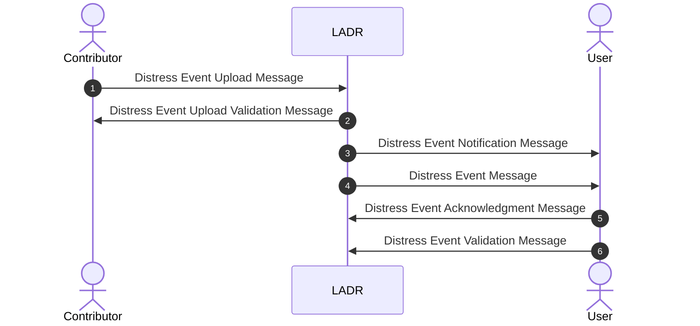

# LADR Application Messages

This GITHUB repository supports the **development** of the XML schemas of the LADR Application Messages that are exchanged between LADR Contributors, LADR and LADR Users. This is NOT the reference for the official releases of the LADR schemas.

## Content
* ./schemas: contains the XSD schemas for the LADR Application Messages **under development**. One folder per LADR Application Message.
* ./samples: contains XML examples of LADR Application Messages conformant to the XSD schemas.
* ./docs: contains the pages that constitute the online guidance for LADR implementers. Based on GitHub Pages and Docsify technologies. See https://eurocontrol-ladr.github.io/ladrApplicationMessages/#/

## Overviews of the LADR Application Messages

## License

Copyright (c) 2022, EUROCONTROL

All rights reserved.

Redistribution and use in source and binary forms, with or without modification, are permitted provided that the following conditions are met:

* Redistributions of source code must retain the above copyright notice, this list of conditions and the disclaimer.

* Redistributions in binary form must reproduce the above copyright notice, this list of conditions and the disclaimer in the documentation and/or other materials provided with the distribution.

* Neither the name of the copyright holder nor the names of its contributors may be used to endorse or promote products derived from this software without specific prior written permission.

DISCLAIMER

THIS SPECIFICATION IS PROVIDED BY THE COPYRIGHT HOLDERS AND CONTRIBUTORS "AS IS" AND ANY EXPRESS OR IMPLIED WARRANTIES, INCLUDING, BUT NOT LIMITED TO, THE IMPLIED WARRANTIES OF MERCHANTABILITY AND FITNESS FOR A PARTICULAR PURPOSE ARE DISCLAIMED. IN NO EVENT SHALL THE COPYRIGHT OWNER OR CONTRIBUTORS BE LIABLE FOR ANY DIRECT, INDIRECT, INCIDENTAL, SPECIAL, EXEMPLARY, OR CONSEQUENTIAL DAMAGES (INCLUDING, BUT NOT LIMITED TO, PROCUREMENT OF SUBSTITUTE GOODS OR SERVICES; LOSS OF USE, DATA, OR PROFITS; OR BUSINESS INTERRUPTION) HOWEVER CAUSED AND ON ANY THEORY OF LIABILITY, WHETHER IN CONTRACT, STRICT LIABILITY, OR TORT (INCLUDING NEGLIGENCE OR OTHERWISE) ARISING IN ANY WAY OUT OF THE USE OF THIS SOFTWARE, EVEN IF ADVISED OF THE POSSIBILITY OF SUCH DAMAGE

Editorial note: this license is an instance of the BSD license template as provided by the Open Source Initiative: http://opensource.org/licenses/BSD-3-Clause

Details about EUROCONTROL are available at
www.eurocontrol.int
