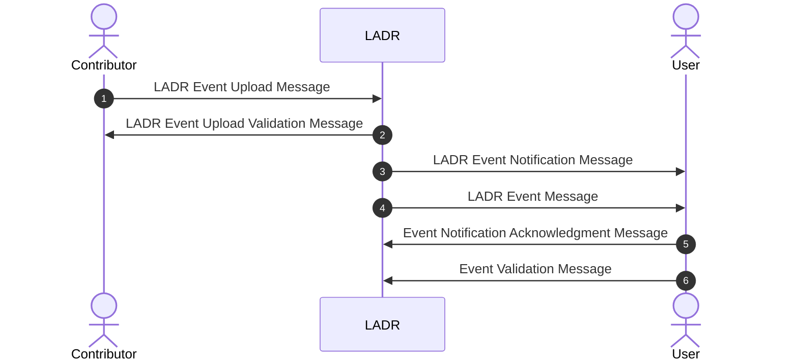

# Welcome to the LADR Schemas documentation

## How to use this web site

- Use the side bar opposite to access the various sections of this manual;
- Use the search engine to look for a specific entry;
- Use the buttons *< Previous* and *Next >* at the bottom of each page to navigate across the different sections of the manual.

## Acronyms

|Acronyms|Definition|
|:-|:--|
|AIRM|ATM Information Reference Model|
|FIXM|Flight Information Exchange Model|
|LADR|Location of Aircraft in Distress Repository|
|...|...|

## References

- LADR: ...
- AIRM: ...
- FIXM: ...
 
