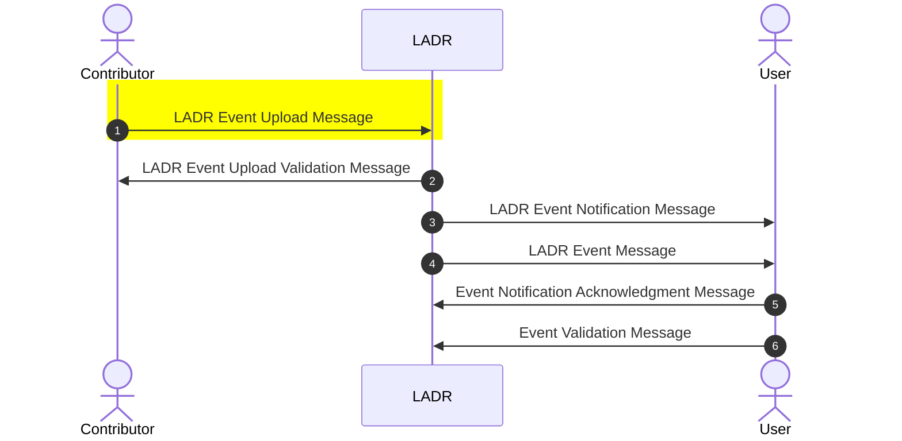
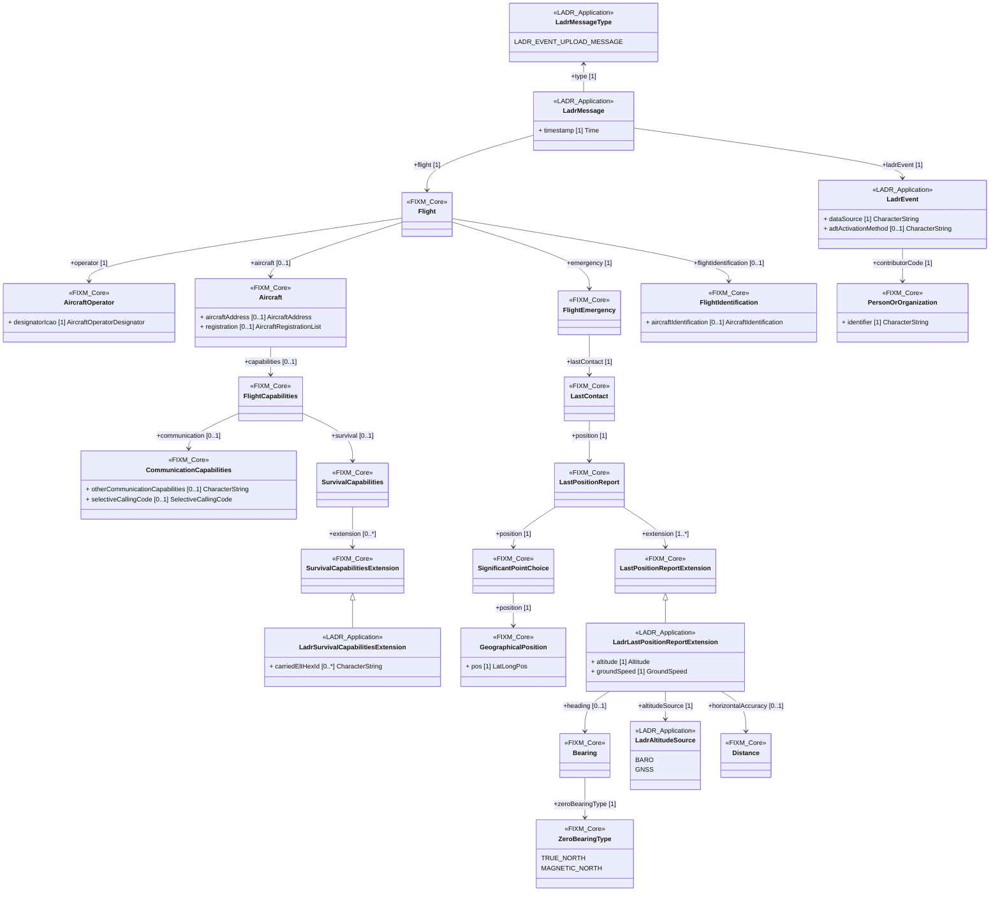

# LADR Event Upload Message

## XML schema and samples

- Go to [Schema definition](https://github.com/hlepori/test_ladr/tree/main/schemas/ladrEventUploadMessage) on Github

|Example|Description|
|:--|:---|
|[LadrEventUploadMessage_Example1_USMCC.xml](https://github.com/hlepori/test_ladr/blob/main/samples/LadrEventUploadMessage_Example1_USMCC.xml)|...|
|[LadrEventUploadMessage_Example2_SPMCC.xml](https://github.com/hlepori/test_ladr/blob/main/samples/LadrEventUploadMessage_Example2_SPMCC.xml)|...|

## UML description

