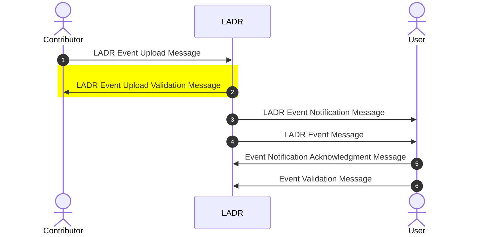
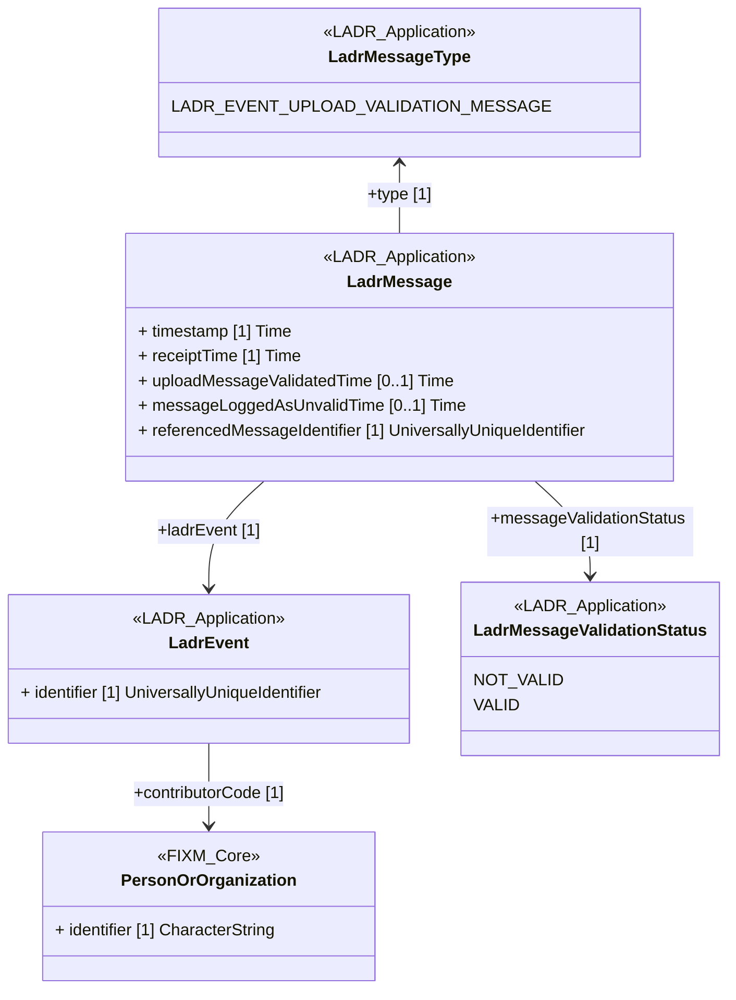

# LADR Event Upload Validation Message

## XML schema and samples

- Go to [Schema definition](https://github.com/hlepori/test_ladr/tree/main/schemas/ladrEventUploadValidationMessage) on Github

- Go to [XML examples](https://github.com/hlepori/test_ladr/tree/main/samples) on Github

## UML description

