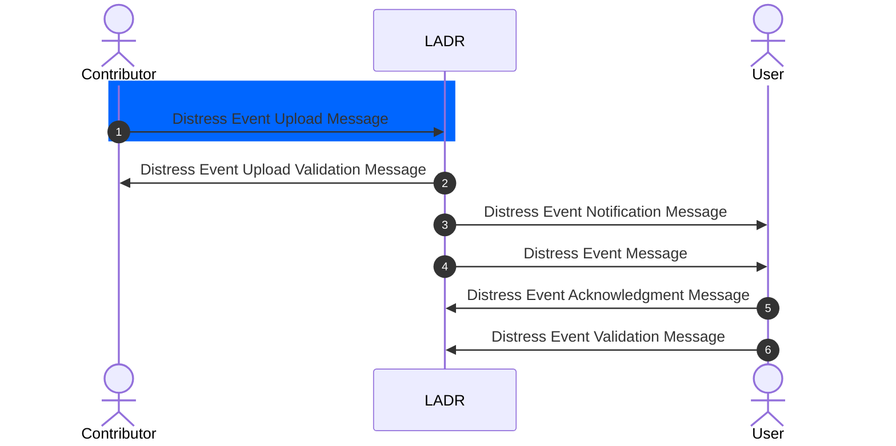
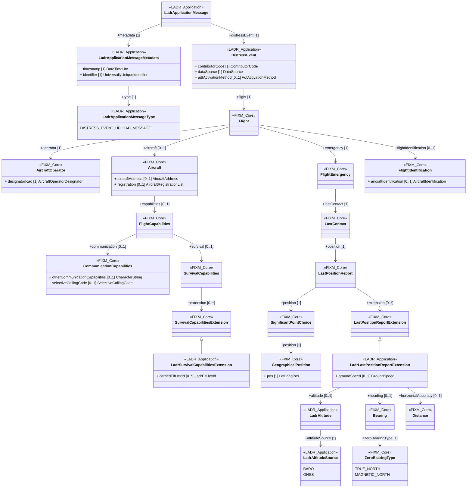

# Distress Event Upload Message

```mermaid
    sequenceDiagram
    autonumber
    actor Contributor
    participant LADR
    actor User
    rect rgb(0, 102, 255)
    Contributor->>LADR: Distress Event Upload Message
    end
    LADR->>Contributor: Distress Event Upload Validation Message
    LADR->> User: Distress Event Notification Message
    LADR->>User: Distress Event Message 
    User->>LADR: Distress Event Acknowledgment Message       
    User->>LADR: Distress Event Validation Message
```

```mermaid	
classDiagram	
class LadrApplicationMessage	
<<LADR_Application>> LadrApplicationMessage	
class LadrApplicationMessageMetadata	
<<LADR_Application>> LadrApplicationMessageMetadata	
LadrApplicationMessageMetadata : + timestamp [1] DateTimeUtc	
class LadrApplicationMessageType	
<<LADR_Application>> LadrApplicationMessageType	
LadrApplicationMessageType : DISTRESS_EVENT_UPLOAD_MESSAGE	
LadrApplicationMessageMetadata --> LadrApplicationMessageType : +type [1]	
LadrApplicationMessageMetadata : + identifier [1] UniversallyUniqueIdentifier	
LadrApplicationMessage --> LadrApplicationMessageMetadata : +metadata [1]	
class DistressEvent	
<<LADR_Application>> DistressEvent	
DistressEvent : + contributorCode [1] ContributorCode	
DistressEvent : + dataSource [1] DataSource	
DistressEvent : + adtActivationMethod [0..1] AdtActivationMethod	
class Flight	
<<FIXM_Core>> Flight	
class AircraftOperator	
<<FIXM_Core>> AircraftOperator	
AircraftOperator : + designatorIcao [1] AircraftOperatorDesignator	
Flight --> AircraftOperator : +operator [1]	
class Aircraft	
<<FIXM_Core>> Aircraft	
Aircraft : + aircraftAddress [0..1] AircraftAddress	
class FlightCapabilities	
<<FIXM_Core>> FlightCapabilities	
class CommunicationCapabilities	
<<FIXM_Core>> CommunicationCapabilities	
CommunicationCapabilities : + otherCommunicationCapabilities [0..1] CharacterString	
CommunicationCapabilities : + selectiveCallingCode [0..1] SelectiveCallingCode	
FlightCapabilities --> CommunicationCapabilities : +communication [0..1]	
class SurvivalCapabilities	
<<FIXM_Core>> SurvivalCapabilities	
class SurvivalCapabilitiesExtension	
<<FIXM_Core>> SurvivalCapabilitiesExtension	
class LadrSurvivalCapabilitiesExtension	
<<LADR_Application>> LadrSurvivalCapabilitiesExtension	
LadrSurvivalCapabilitiesExtension : + carriedEltHexId [0..*] LadrEltHexId	
SurvivalCapabilitiesExtension<|-- LadrSurvivalCapabilitiesExtension	
SurvivalCapabilities --> SurvivalCapabilitiesExtension : +extension [0..*]	
FlightCapabilities --> SurvivalCapabilities : +survival [0..1]	
Aircraft --> FlightCapabilities : +capabilities [0..1]	
Aircraft : + registration [0..1] AircraftRegistrationList	
Flight --> Aircraft : +aircraft [0..1]	
class FlightEmergency	
<<FIXM_Core>> FlightEmergency	
class LastContact	
<<FIXM_Core>> LastContact	
class LastPositionReport	
<<FIXM_Core>> LastPositionReport	
class SignificantPointChoice	
<<FIXM_Core>> SignificantPointChoice	
class GeographicalPosition	
<<FIXM_Core>> GeographicalPosition	
GeographicalPosition : + pos [1] LatLongPos	
SignificantPointChoice --> GeographicalPosition : +position [1]	
LastPositionReport --> SignificantPointChoice : +position [1]	
class LastPositionReportExtension	
<<FIXM_Core>> LastPositionReportExtension	
class LadrLastPositionReportExtension	
<<LADR_Application>> LadrLastPositionReportExtension	
class LadrAltitude	
<<LADR_Application>> LadrAltitude	
class LadrAltitudeSource	
<<LADR_Application>> LadrAltitudeSource	
LadrAltitudeSource : BARO	
LadrAltitudeSource : GNSS	
LadrAltitude --> LadrAltitudeSource : +altitudeSource [1]	
LadrLastPositionReportExtension --> LadrAltitude : +altitude [0..1]	
class Bearing	
<<FIXM_Core>> Bearing	
class ZeroBearingType	
<<FIXM_Core>> ZeroBearingType	
ZeroBearingType : TRUE_NORTH	
ZeroBearingType : MAGNETIC_NORTH	
Bearing --> ZeroBearingType : +zeroBearingType [1]	
LadrLastPositionReportExtension --> Bearing : +heading [0..1]	
LadrLastPositionReportExtension : + groundSpeed [0..1] GroundSpeed	
class Distance	
<<FIXM_Core>> Distance	
LadrLastPositionReportExtension --> Distance : +horizontalAccuracy [0..1]	
LastPositionReportExtension<|-- LadrLastPositionReportExtension	
LastPositionReport --> LastPositionReportExtension : +extension [0..*]	
LastContact --> LastPositionReport : +position [1]	
FlightEmergency --> LastContact : +lastContact [1]	
Flight --> FlightEmergency : +emergency [1]	
class FlightIdentification	
<<FIXM_Core>> FlightIdentification	
FlightIdentification : + aircraftIdentification [0..1] AircraftIdentification	
Flight --> FlightIdentification : +flightIdentification [0..1]	
DistressEvent --> Flight : +flight [1]	
LadrApplicationMessage --> DistressEvent : +distressEvent [1]	
```	

