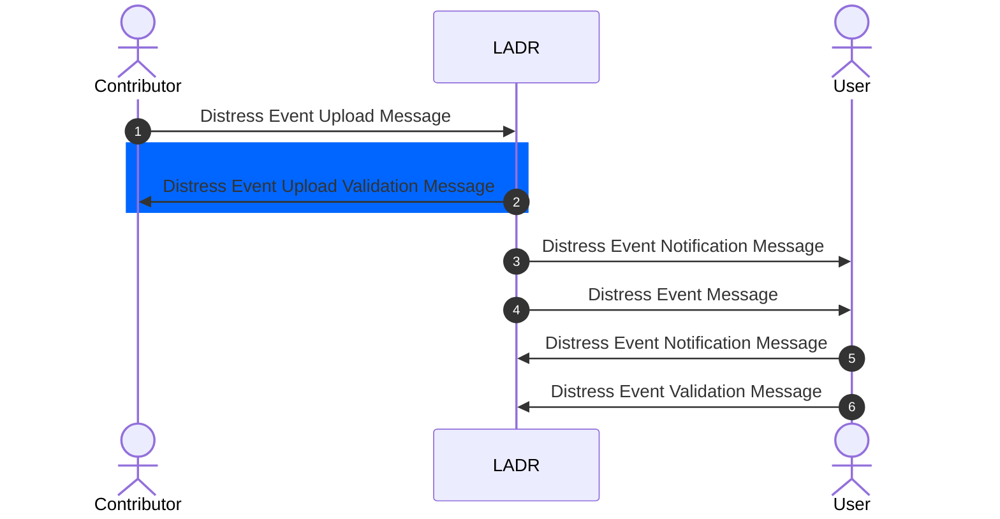
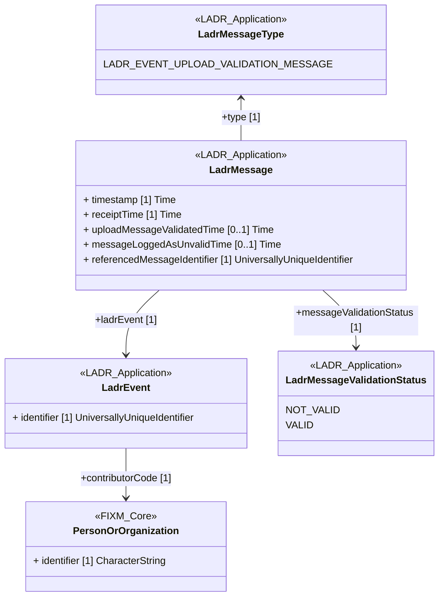

# Distress Event Upload Validation Message

```mermaid
    sequenceDiagram
    autonumber
    actor Contributor
    participant LADR
    actor User
    Contributor->>LADR: Distress Event Upload Message
    rect rgb(0, 102, 255)
    LADR->>Contributor: Distress Event Upload Validation Message
    end
    LADR->> User: Distress Event Notification Message
    LADR->>User: Distress Event Message 
    User->>LADR: Distress Event Notification Message       
    User->>LADR: Distress Event Validation Message
```

```mermaid
classDiagram
class LadrMessage	
<<LADR_Application>> LadrMessage	
LadrMessage : + timestamp [1] Time	
class LadrMessageType	
<<LADR_Application>> LadrMessageType	
LadrMessageType : LADR_EVENT_UPLOAD_VALIDATION_MESSAGE	
LadrMessageType <-- LadrMessage : +type [1]	
LadrMessage : + receiptTime [1] Time	
class LadrEvent	
<<LADR_Application>> LadrEvent	
class PersonOrOrganization	
<<FIXM_Core>> PersonOrOrganization	
PersonOrOrganization : + identifier [1] CharacterString	
LadrEvent --> PersonOrOrganization : +contributorCode [1]	
LadrEvent : + identifier [1] UniversallyUniqueIdentifier	
LadrMessage --> LadrEvent : +ladrEvent [1]	
class LadrMessageValidationStatus	
<<LADR_Application>> LadrMessageValidationStatus	
LadrMessageValidationStatus : NOT_VALID	
LadrMessageValidationStatus : VALID	
LadrMessage --> LadrMessageValidationStatus : +messageValidationStatus [1]	
LadrMessage : + uploadMessageValidatedTime [0..1] Time	
LadrMessage : + messageLoggedAsUnvalidTime [0..1] Time	
LadrMessage : + referencedMessageIdentifier [1] UniversallyUniqueIdentifier	
```
